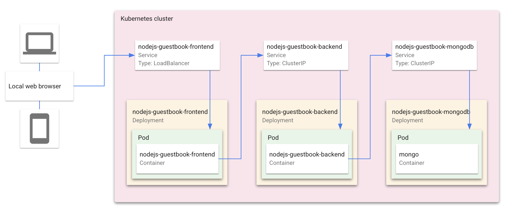
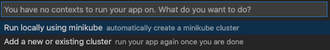
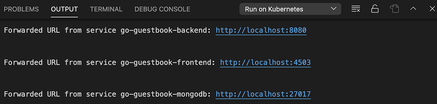
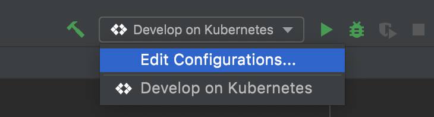
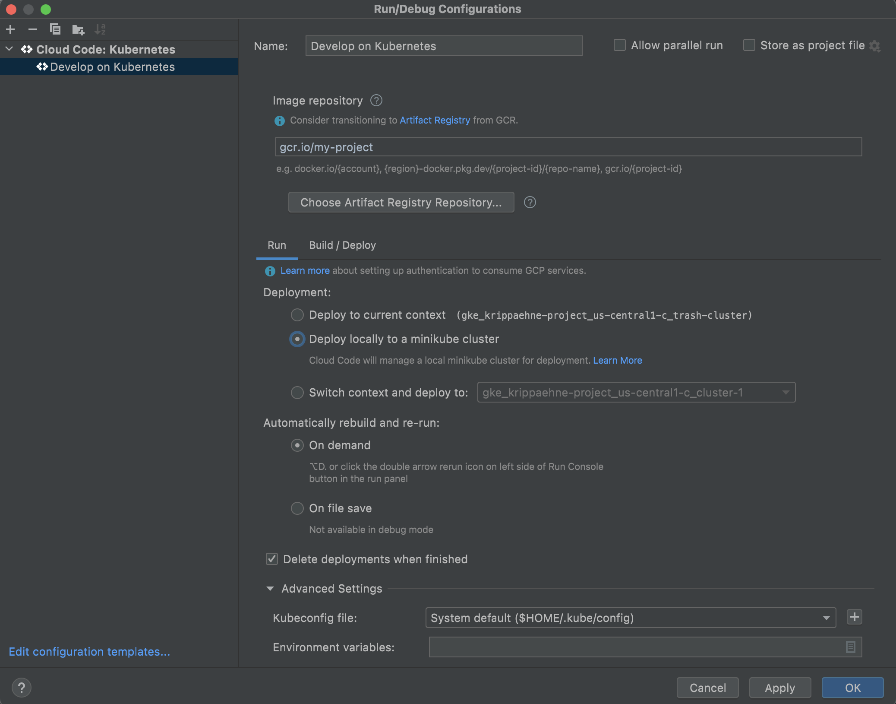
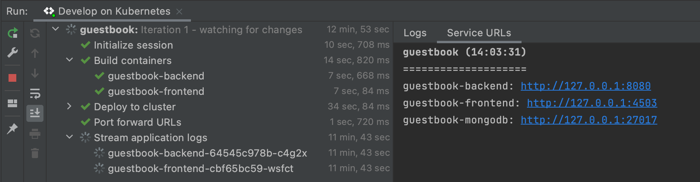

# Guestbook with Cloud Code

This project is a **Google Cloud Kubernetes template** that has been enhanced from the original Guestbook sample. It demonstrates how to deploy a production-ready Kubernetes application with a frontend service, backend API, and MongoDB database using the Cloud Code IDE extension.

## Project Overview

This project started as a basic Google Cloud Kubernetes template and has been systematically enhanced following the roadmap outlined in [PROJECT_OVERVIEW.md](./PROJECT_OVERVIEW.md) (starting from line 215). The enhancements transform it from a simple demonstration app into a more production-ready application with modern features and best practices.

### What We've Built

This is a full-stack guestbook application that allows users to:
- **Post messages** with their name and optional images
- **View messages** in reverse chronological order with pagination
- **Edit and delete** their own messages (with authentication)
- **Real-time updates** via WebSocket connections
- **User authentication** and authorization
- **Mobile-responsive** design

### Key Enhancements Implemented

Based on the enhancement roadmap, the following features have been added:

✅ **Production Infrastructure**
- Health checks (liveness and readiness probes) for all deployments
- Persistent storage for MongoDB using StatefulSet and PersistentVolumeClaims
- Ingress controller for production-ready external access (replacing LoadBalancer)
- Network Policies for enhanced security and traffic control

✅ **Application Features**
- User authentication and authorization system
- Message editing and deletion capabilities
- Pagination for large message lists
- Image upload support
- Real-time updates using WebSockets
- Mobile-responsive design improvements

✅ **DevOps & Observability**
- Monitoring and observability with metrics endpoints
- Modular architecture with shared utilities
- CI/CD pipeline configuration
- Comprehensive logging and error handling

For more detailed information about the project architecture, objectives, and technical stack, see [PROJECT_OVERVIEW.md](./PROJECT_OVERVIEW.md).

For details on how to use this sample as a template in Cloud Code, read the documentation for Cloud Code for [VS Code](https://cloud.google.com/code/docs/vscode/quickstart-local-dev?utm_source=ext&utm_medium=partner&utm_campaign=CDR_kri_gcp_cloudcodereadmes_012521&utm_content=-) or [IntelliJ](https://cloud.google.com/code/docs/intellij/quickstart-k8s?utm_source=ext&utm_medium=partner&utm_campaign=CDR_kri_gcp_cloudcodereadmes_012521&utm_content=-).

### Table of Contents
* [What's in this sample](#whats-in-this-sample)
* [Architecture Overview](#architecture-overview)
* [Getting Started with VS Code](#getting-started-with-vs-code)
* [Getting Started with IntelliJ](#getting-started-with-intellij)
* [Project Documentation](#project-documentation)
* [Sign up for User Research](#sign-up-for-user-research)

---
## What's in this sample

### Kubernetes architecture


### Architecture Overview

This project follows a **three-tier architecture**:

1. **Frontend Service** (`src/frontend/`)
   - Node.js/Express web server serving Pug templates
   - Handles user interactions and form submissions
   - Communicates with backend via REST API
   - Exposed via Ingress controller

2. **Backend Service** (`src/backend/`)
   - Node.js/Express API server with RESTful endpoints
   - Handles authentication, authorization, and business logic
   - WebSocket support for real-time updates
   - Internal service (ClusterIP) accessible only within cluster

3. **MongoDB Database** (`src/backend/kubernetes-manifests/mongo.*.yaml`)
   - MongoDB 4 running as StatefulSet
   - Persistent storage using PersistentVolumeClaims
   - Internal service (ClusterIP) accessible only within cluster

### Directory Structure

```
guestbook-1/
├── src/
│   ├── frontend/                    # Frontend service
│   │   ├── app.js                   # Express server
│   │   ├── views/                   # Pug templates
│   │   ├── public/                  # Static assets (CSS)
│   │   ├── utils/                   # Frontend utilities
│   │   ├── Dockerfile
│   │   ├── skaffold.yaml
│   │   └── kubernetes-manifests/    # Frontend K8s resources
│   │       ├── guestbook-frontend.deployment.yaml
│   │       ├── guestbook-frontend.service.yaml
│   │       └── guestbook-frontend.ingress.yaml
│   │
│   ├── backend/                     # Backend API service
│   │   ├── app.js                   # Express server
│   │   ├── routes/                  # API routes (auth, messages, users)
│   │   ├── Dockerfile
│   │   ├── skaffold.yaml
│   │   └── kubernetes-manifests/    # Backend & DB K8s resources
│   │       ├── guestbook-backend.deployment.yaml
│   │       ├── guestbook-backend.service.yaml
│   │       ├── mongo.statefulset.yaml
│   │       ├── mongo.service.yaml
│   │       ├── mongo.pvc.yaml
│   │       └── network-policy.yaml
│   │
│   └── shared/                      # Shared utilities
│       ├── middleware/              # Authentication, metrics middleware
│       └── utils/                   # Auth, config, logging, validation, etc.
│
├── skaffold.yaml                    # Root Skaffold configuration
├── Dockerfile                       # Root Dockerfile (if any)
├── PROJECT_OVERVIEW.md             # Detailed project documentation
└── docs/                            # Additional documentation
```

### Key Kubernetes Resources

- **Frontend Deployment & Service**: Web UI exposed via Ingress
- **Backend Deployment & Service**: Internal API service (ClusterIP)
- **MongoDB StatefulSet**: Persistent database with PVC
- **Ingress**: Production-ready external access (replaces LoadBalancer)
- **Network Policies**: Security rules for pod-to-pod communication
- **Health Checks**: Liveness and readiness probes on all deployments

---
## Getting Started with VS Code

### Run the app locally with minikube

1. To run your application, click on the Cloud Code status bar and select ‘Run on Kubernetes’.  


2. Select ‘Run locally using minikube’ when prompted. Cloud Code runs your app in a local [minikube](https://minikube.sigs.k8s.io/docs/start/) cluster.  


3. View the build progress in the OUTPUT window. Once the build has finished, click on the front end service's URL in the OUTPUT window to view your live application.  


4.  To stop the application, click the stop icon on the Debug Toolbar.

---

## Getting Started with IntelliJ

### Run the app locally with minikube

#### Edit run configuration
1. Click the configuration dropdown in the top taskbar and then click **Edit Configurations**.


   The **Develop on Kubernetes** configuration watches for changes, then uses [skaffold](https://skaffold.dev/docs/) to rebuild and rerun your app. You can customize your deployment by making changes to this run configuration or by creating a new Cloud Code: Kubernetes run configuration.


3. Under **Run > Deployment**, select 'Deploy locally to a minikube cluster'.


4. Click **OK** to save your configuration. 


#### Run the app on minikube
1. Select **Develop on Kubernetes** from the configuration dropdown and click the run icon. Cloud Code runs your app in a local [minikube](ttps://minikube.sigs.k8s.io/docs/start/) cluster.  


2. View the build process in the output window. When the deployment is successful, you're notified that new service URLs are available. Click the Service URLs tab to view the URL(s), then click the URL link to open your browser with your running application.  


3. To stop the application, click the stop icon next to the configuration dropdown.
