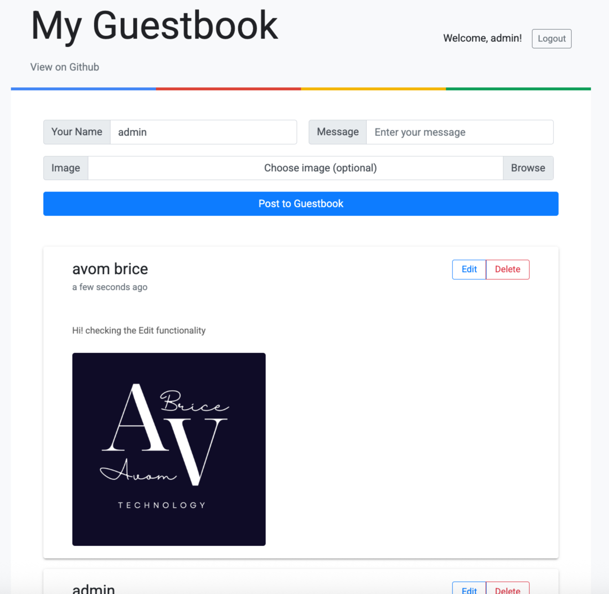

# Production-Ready Guestbook Application - Kubernetes Deployment



A full-stack, cloud-native guestbook application demonstrating production-ready Kubernetes deployment patterns, container orchestration, and modern DevOps practices. This project showcases enterprise-level infrastructure management, persistent storage solutions, and comprehensive observability.

> **Based On**: Enhanced version of the [Google Cloud Kubernetes Guestbook sample](https://github.com/GoogleCloudPlatform/cloud-code-samples/blob/v1/nodejs/nodejs-guestbook/README.md) from Google Cloud Platform's cloud-code-samples repository, transformed into a production-ready application with advanced features and best practices.

## Project Summary

This project demonstrates expertise in:
- **Cloud-Native Architecture**: Three-tier microservices architecture on Kubernetes
- **Production Infrastructure**: StatefulSets, PersistentVolumeClaims, Ingress, Network Policies
- **DevOps Excellence**: CI/CD pipelines, health monitoring, automated deployments
- **Security Best Practices**: JWT authentication, network policies, input validation
- **Observability**: Metrics endpoints, logging, health checks
- **Modern Development**: Docker, Skaffold, GitHub Actions

## Key Features

### Application Capabilities
- **Message Management**: Create, edit, and delete messages with authentication
- **Image Uploads**: Support for JPEG, PNG, GIF, WebP (up to 5MB) with validation
- **User Authentication**: JWT-based authentication with bcrypt password hashing
- **Real-Time Updates**: WebSocket integration using Socket.IO
- **Responsive Design**: Mobile-optimized user interface
- **Pagination**: Efficient message listing for large datasets

### Production Infrastructure
- **Persistent Storage**: StatefulSets with PVCs for database (10Gi) and file storage (5Gi)
- **Health Monitoring**: Liveness and readiness probes on all services
- **Security**: Network Policies, JWT authentication, input validation
- **Observability**: Metrics endpoints, comprehensive logging, error tracking
- **Scalability**: Designed for horizontal scaling with stateless frontend
- **CI/CD**: Automated testing and deployment with GitHub Actions

## Architecture

### Three-Tier Microservices Architecture

```
┌─────────────────────────────────────────────────────────────┐
│                     Ingress Controller                       │
│              (Production-Ready External Access)              │
└───────────────────────────┬─────────────────────────────────┘
                            │
            ┌───────────────┴───────────────┐
            │                               │
    ┌───────▼──────┐              ┌────────▼────────┐
    │   Frontend   │              │    Backend      │
    │  (Deployment)│              │  (StatefulSet)  │
    │              │              │                 │
    │ Node.js      │◄─────────────┤ Node.js/Express │
    │ Express      │   REST API   │ JWT Auth        │
    │ Pug Templates│              │ Socket.IO       │
    │ Static Assets│              │ File Uploads    │
    └──────────────┘              └────────┬────────┘
                                           │
                                  ┌────────▼────────┐
                                  │    MongoDB      │
                                  │  (StatefulSet)  │
                                  │                 │
                                  │ Persistent Data │
                                  │    (10Gi PVC)   │
                                  └─────────────────┘
```

### Components

1. **Frontend Service** (Stateless)
   - Node.js/Express web server
   - Pug template engine
   - Serves static assets and UI
   - Exposed via Ingress controller
   - Deployed as Kubernetes Deployment

2. **Backend Service** (Stateful)
   - RESTful API with Express
   - JWT authentication & authorization
   - WebSocket support (Socket.IO)
   - Image upload handling with Persistent data storage (5Gi PVC)
   - Metrics and health endpoints
   - Deployed as StatefulSet with 5Gi persistent storage

3. **MongoDB Database** (Stateful)
   - MongoDB 4 StatefulSet
   - Persistent data storage (10Gi PVC)
   - Headless service for stable networking
   - Data persistence across pod restarts

### Design Decisions

- **StatefulSets** for stateful components (database & file storage)
- **PersistentVolumeClaims** for data persistence
- **Network Policies** for secure pod-to-pod communication
- **Health Checks** (liveness/readiness probes) for reliability
- **Ingress Controller** instead of LoadBalancer for cost efficiency
- **Modular Architecture** with shared utilities and middleware

## Technology Stack

### Backend
- **Runtime**: Node.js
- **Framework**: Express.js
- **Database**: MongoDB with Mongoose ODM
- **Authentication**: JWT (jsonwebtoken) + bcrypt
- **Real-Time**: Socket.IO
- **File Handling**: Multer with validation

### Frontend
- **Runtime**: Node.js
- **Framework**: Express.js
- **Templating**: Pug
- **HTTP Client**: Axios
- **Real-Time**: Socket.IO Client

### Infrastructure & DevOps
- **Orchestration**: Kubernetes
- **Containerization**: Docker (multi-stage builds)
- **Development**: Skaffold
- **CI/CD**: GitHub Actions
- **Storage**: PersistentVolumeClaims
- **Networking**: Ingress, Network Policies

## Project Structure

```
guestbook-1/
├── src/
│   ├── frontend/                    # Frontend service
│   │   ├── app.js                   # Express server
│   │   ├── views/                   # Pug templates
│   │   │   ├── home.pug
│   │   │   ├── list.pug
│   │   │   └── new.pug
│   │   ├── public/css/              # Static assets
│   │   ├── utils/                   # Frontend utilities
│   │   ├── Dockerfile
│   │   ├── skaffold.yaml
│   │   └── kubernetes-manifests/    # K8s resources
│   │       ├── guestbook-frontend.deployment.yaml
│   │       ├── guestbook-frontend.service.yaml
│   │       └── guestbook-frontend.ingress.yaml
│   │
│   ├── backend/                     # Backend API service
│   │   ├── app.js                   # Express server
│   │   ├── routes/                  # API routes
│   │   │   ├── auth.js              # Authentication endpoints
│   │   │   ├── messages.js          # Message CRUD operations
│   │   │   ├── users.js             # User management
│   │   │   └── index.js             # Health/metrics endpoints
│   │   ├── Dockerfile
│   │   ├── skaffold.yaml
│   │   └── kubernetes-manifests/    # Backend & DB resources
│   │       ├── guestbook-backend.statefulset.yaml
│   │       ├── guestbook-backend.service.yaml
│   │       ├── mongo.statefulset.yaml
│   │       ├── mongo.service.yaml
│   │       ├── mongo.pvc.yaml
│   │       └── network-policy.yaml
│   │
│   └── shared/                      # Shared utilities
│       ├── middleware/
│       │   ├── authenticate.js      # JWT authentication middleware
│       │   └── metrics.js           # Metrics collection
│       └── utils/
│           ├── auth.js              # Auth utilities
│           ├── config.js            # Configuration management
│           ├── errorHandler.js      # Error handling
│           ├── fileUpload.js        # File upload utilities
│           ├── logger.js            # Logging utilities
│           ├── retry.js             # Retry logic
│           ├── socketManager.js     # Socket.IO management
│           └── validation.js        # Input validation
│
├── docs/                            # Documentation
│   ├── PROJECT_K8_DEPLOYMENT_GUIDE.md
│   ├── PROJECT_OVERVIEW.md
│   ├── PROJECT_K8_ARCHITECTURE.md
│   ├── MINIKUBE_&_GKE_EMULATOR_SETUP.md
│   └── TROUBLESHOOTING.md
│
├── img/                             # Project screenshots
├── skaffold.yaml                    # Root Skaffold config
├── Dockerfile                       # Root Dockerfile
└── README.md                        # This file
```

## Quick Start

### Prerequisites
- Kubernetes cluster (Minikube, GKE, EKS, or Docker Desktop)
- `kubectl` configured
- Docker installed

### Deploy to Kubernetes

```bash
# Deploy MongoDB StatefulSet
kubectl apply -f src/backend/kubernetes-manifests/mongo.statefulset.yaml
kubectl apply -f src/backend/kubernetes-manifests/mongo.service.yaml

# Deploy Backend StatefulSet
kubectl apply -f src/backend/kubernetes-manifests/guestbook-backend.statefulset.yaml
kubectl apply -f src/backend/kubernetes-manifests/guestbook-backend.service.yaml

# Deploy Frontend
kubectl apply -f src/frontend/kubernetes-manifests/

# Apply Network Policies
kubectl apply -f src/backend/kubernetes-manifests/network-policy.yaml

# Verify deployment
kubectl get all -l app=nodejs-guestbook
kubectl get pvc -l app=nodejs-guestbook
```

### Using Cloud Code (VS Code)

1. Open project in VS Code with Cloud Code extension
2. Click "Run on Kubernetes" from the debug panel
3. Select your cluster (minikube for local development)
4. Access the application via the provided URL

## Documentation

Comprehensive documentation is available in the `docs/` directory:

- **[Deployment Guide](./docs/PROJECT_K8_DEPLOYMENT_GUIDE.md)**: Complete guide to deploying and managing the Kubernetes cluster, including StatefulSet configuration and persistent storage
- **[Project Overview](./docs/PROJECT_OVERVIEW.md)**: Detailed project architecture, objectives, and technical decisions
- **[Kubernetes Architecture](./docs/PROJECT_K8_ARCHITECTURE.md)**: Deep dive into Kubernetes concepts, service discovery, health checks, and networking
- **[Minikube & GKE Setup](./docs/MINIKUBE_&_GKE_EMULATOR_SETUP.md)**: Setup instructions for local development environments
- **[Troubleshooting](./docs/TROUBLESHOOTING.md)**: Common issues and solutions

## Improvements Over Base Project

This project significantly enhances the original Google Cloud Kubernetes Guestbook sample:

### Infrastructure Enhancements
- **Persistent Storage**: Migrated from ephemeral to persistent storage using StatefulSets and PersistentVolumeClaims
- **Production-Grade Networking**: Implemented Ingress controller replacing LoadBalancer
- **Security Hardening**: Added Network Policies for pod-to-pod communication security
- **Health Monitoring**: Comprehensive liveness and readiness probes

### Application Features
- **Authentication System**: Complete JWT-based authentication with bcrypt password hashing
- **File Persistence**: Backend StatefulSet ensuring uploaded images persist across deployments
- **Real-Time Communication**: WebSocket support for live updates
- **Input Validation**: Comprehensive validation and error handling

### DevOps & Operations
- **CI/CD Pipeline**: GitHub Actions workflows for automated testing and deployment
- **Observability**: Metrics endpoints, structured logging, error tracking
- **Documentation**: Extensive deployment guides, architecture documentation, and troubleshooting resources
- **Modular Architecture**: Shared utilities and middleware for maintainability

## Technical Achievements

- **Stateful Application Migration**: Successfully migrated both database and backend services from ephemeral Deployments to persistent StatefulSets
- **Storage Architecture**: Implemented automatic PVC creation via volumeClaimTemplates for seamless storage management
- **Production Patterns**: Established enterprise-grade deployment patterns suitable for production environments
- **Full-Stack Development**: End-to-end application development from frontend UI to backend API and database layer

## Acknowledgments

This project is based on and extends the [Google Cloud Kubernetes Guestbook sample](https://github.com/GoogleCloudPlatform/cloud-code-samples/tree/v1/nodejs/nodejs-guestbook) from Google Cloud Platform's [cloud-code-samples](https://github.com/GoogleCloudPlatform/cloud-code-samples) repository.

For details on using this sample as a template in Cloud Code, see the documentation for [Cloud Code for VS Code](https://cloud.google.com/code/docs/vscode/quickstart-local-dev) or [Cloud Code for IntelliJ](https://cloud.google.com/code/docs/intellij/quickstart-k8s).

---

**Built showcasing production-ready Kubernetes deployment expertise**
